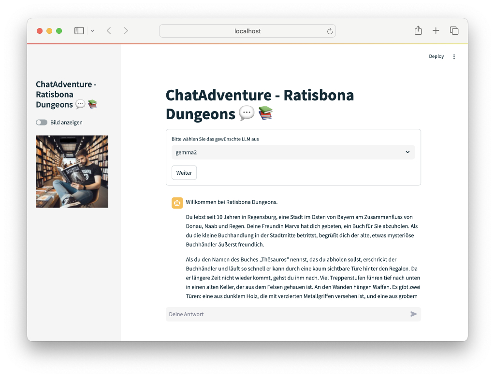
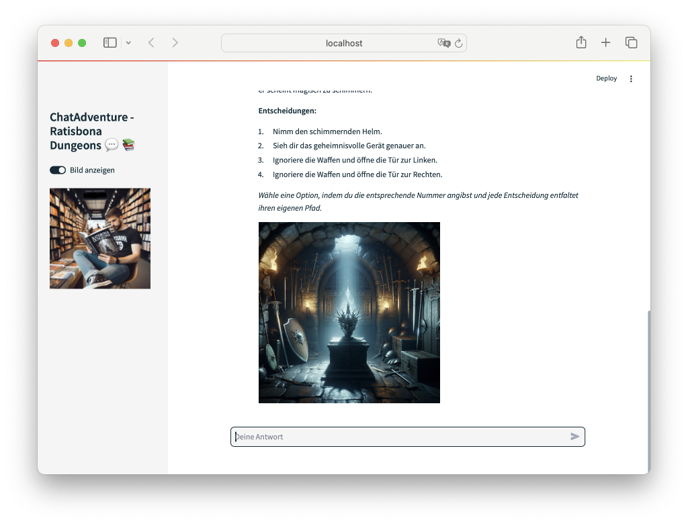

# chatAdventure - ratisbona dungeons

        

You explore the dungeons beneath the city of Regensburg. The entire story and characters are managed by ChatGPT or another Large Language Model (LLM).

                     

## Installation

### Play on the Web

The game chatAdventure-ratisbona dungeons is freely available on the Streamlit Cloud.

Simply click on this link: [https://radisbona-adventure.streamlit.app](https://radisbona-adventure.streamlit.app)

### Local Installation

* Copy the directory from GitHub to your local drive
* Change to the directory
* Ensure all Python modules are present **pip install -r requirements.txt**
* Start the application with **streamlit run app.py**

### Local LLM

* Install Ollama (https://ollama.com)
* Load and start the model
* Then start the game

## Generating Images

Currently, generating images is only possible with Dall-E and the corresponding API key from OpenAI

    