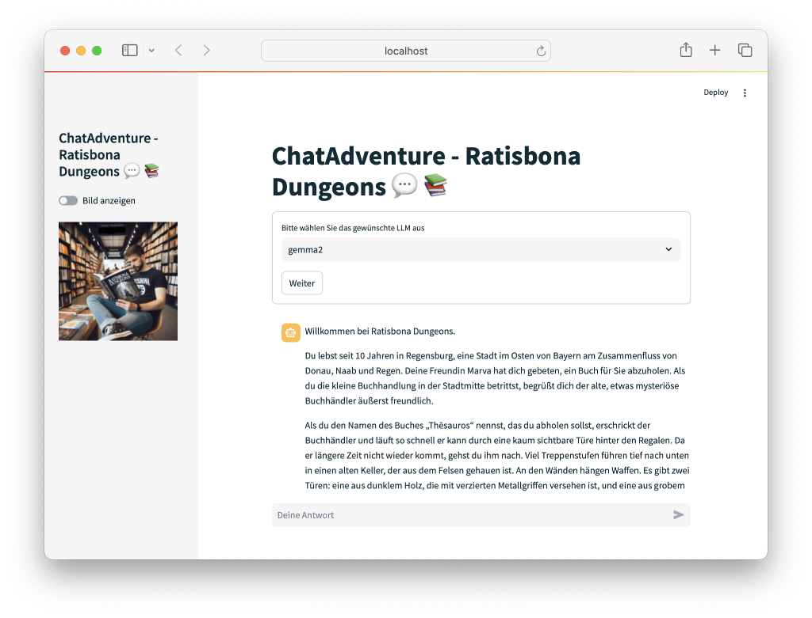

# chatAdventure - ratisbona dungeons

        

Du erforscht die Dungeons unter der Stadt Regensburg. Die komplette Handlung und Personen übernimmt ChatGPT oder eine anderes Large Language Model(LLM).

                     

## Installation

### Im Web spielen

Das Spiel chatAdventure-ratisbona dungeons steht in der Streamlit Cloud frei zur Verfügung.

Einfach auf diesen Link https://radisbona-adventure.streamlit.app klicken

### Lokale Installation

* Verzeichnis von GitHub auf Platte kopieren
* In das Verzeichnis wechseln
* Sicherstellen, dass alle Python-Module vorhanden sind **pip install -r requirements.txt**
* Starten der Anwendung mit **streamlit run app.py**

### Lokales LLM

* Ollama installieren (https://ollama.com)
* Model laden und starten
* Danach Spiel starten

## Bilder generieren

Das Generieren der Bilder ist aktuell nur mit Dall-E und dem entsprechenden API-KEY von OpenAI möglich

    
